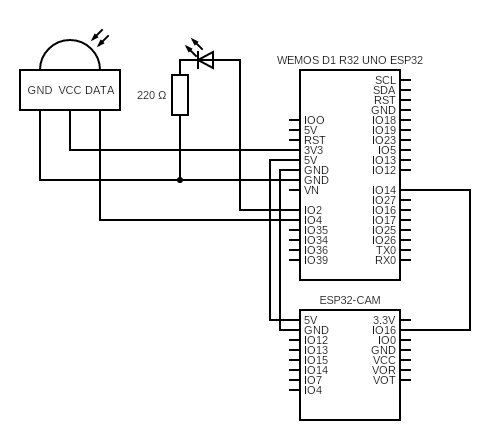

# IMP - Security device - Motion detection & camera
This project was focuse on creating motion detection system that will take a picture after motion has been detected.  
Motion detection part of the project is using `WeMos D1 R32 UNO ESP32` and `AM312 PIR Motion sensor`.  
This is connected using breadboard to the `AI-Thinker's ESP32-CAM`.
## Connection schema

## Usage