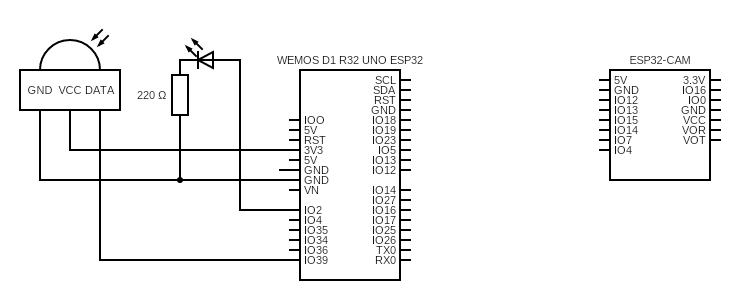

# IMP - Security device - Motion detection & camera
The focus of this project is the creation of a motion detection system that will take a picture after motion is detected.  
The motion detection part of the project uses `WeMos D1 R32 UNO ESP32` and `AM312 PIR Motion sensor`. This part connects to the wireless network created by `AI-Thinker's ESP32-CAM`, allowing it to pass detected motion information using HTTP requests.  
The latest captured picture shows on the webserver available on `AI-Thinker's ESP32-CAM`.
## Usage
The project uses [PlatformIO in VSCode](https://docs.platformio.org/en/latest/integration/ide/vscode.html); as such, the simplest way to use this project would be to open it in PlatformIO and upload it to your device.  
Please note that this project has two parts that you must upload separately - `security-pir` (`WeMos D1 R32 UNO ESP32`) and `security-cam` (`AI-Thinker's ESP32-CAM`).  
For a detailed tutorial on opening a project in PlatformIO in VSCode, please refer to their documentation.
## Connection schema
The connection contains a PIR sensor connected to `WeMos D1 R32 UNO ESP32` and one `debug` LED that will blink when motion is detected.  
Communication between `WeMos D1 R32 UNO ESP32` and `AI-Thinker's ESP32-CAM` is purely wireless.  

## Known limitations & bugs
- ...
